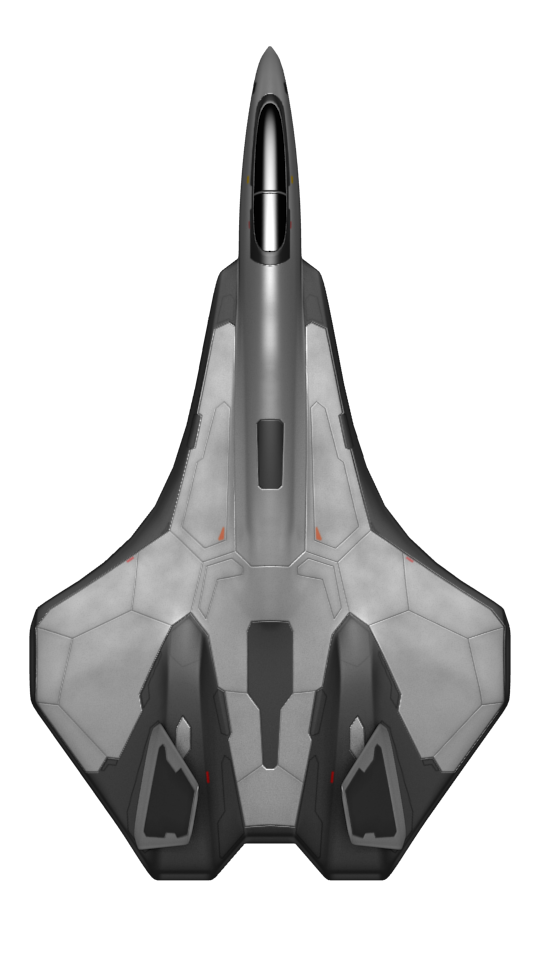
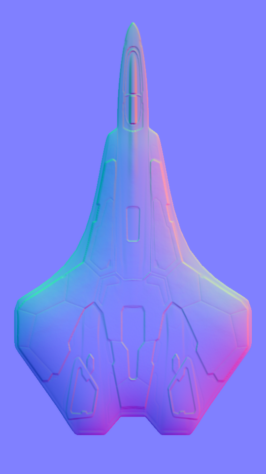

Archwyvern.Space2D.ImageProcessor
=================================

This is a program I made (am making) to generate normal maps for 2D sprites.
It doesn't work very well on Windows because I suck at multithreading so I had to limit the number of
parallel threads to 4 when on the Windows OS. It's still sort of fast, but might complain sometimes.

The end goal of this project is to be able to run the program on a directory of images
and for all normal maps (or any other things) to have consistent outputs regardless
of image dimensions or alpha density.

TODO: Make for all images in directory.

Input             |  Output
:-------------------------:|:-------------------------:
  |  

    $ ImageProcessor.exe normal-map --help
    DESCRIPTION:
    Generate a normal map for an image or all images in a directory

    USAGE:
        ImageProcessor.exe normal-map [Source] [Output] [OPTIONS]

    EXAMPLES:
        ImageProcessor.exe normal-map ship.php
        ImageProcessor.exe normal-map ship.php ship_n.png
        ImageProcessor.exe normal-map ship.php -suffix=_n
        ImageProcessor.exe normal-map -d=./source -o=./output

    ARGUMENTS:
        [Source]    Path to source of a single image
        [Output]    Path to output of a single image

    OPTIONS:
                                  DEFAULT
        -h, --help                                     Prints help information
        -s, --suffix              _n                   The suffix to add to the
                                                       output file(s) e.g. ship.png
                                                       => ship_n.png, ignored if
                                                       output argument is specified
        -d, --source-directory                         Path to output of a single
                                                       image
        -r, --recursive                                Recursively search through
                                                       source-directory
        -o, --output-directory
        -f, --file-filter         ^.+?(?<!_n)\.png$    Regex for file name filter,
                                                       by default allows PNG files
                                                       without the _n suffix, or if
                                                       output-suffix is specified
                                                       any PNG without that suffix
            --bevel-ratio         100                  The percentage of depth to
                                                       apply the bevel, this is
                                                       roughly based on the number
                                                       of opaque pixels
            --bevel-height        100                  The percentage of ratio to do
                                                       weird stuff with how much of
                                                       the image is faded. Less
                                                       makes the normals appear more
                                                       on the outside
            --bevel-smooth        25                   Percentage of ratio to apply
                                                       gaussian blur after beveling,
                                                       alpha is preserved
            --emboss-height       3                    The height percentage of the
                                                       emboss effect, higher
                                                       percentage results in more
                                                       vivid colors
            --emboss-smooth       1                    The number of pixels to blur
                                                       the source image before
                                                       applying emboss

Credits:
- ImageSharp: https://sixlabors.com/products/imagesharp/
- Example Image: https://imgbin.com/png/9zPr0DJe/galaga-spaceship-s80-spaceship-free-spacecraft-png
- Some ChatGPT for the custom gaussian blur implementation, sorry.