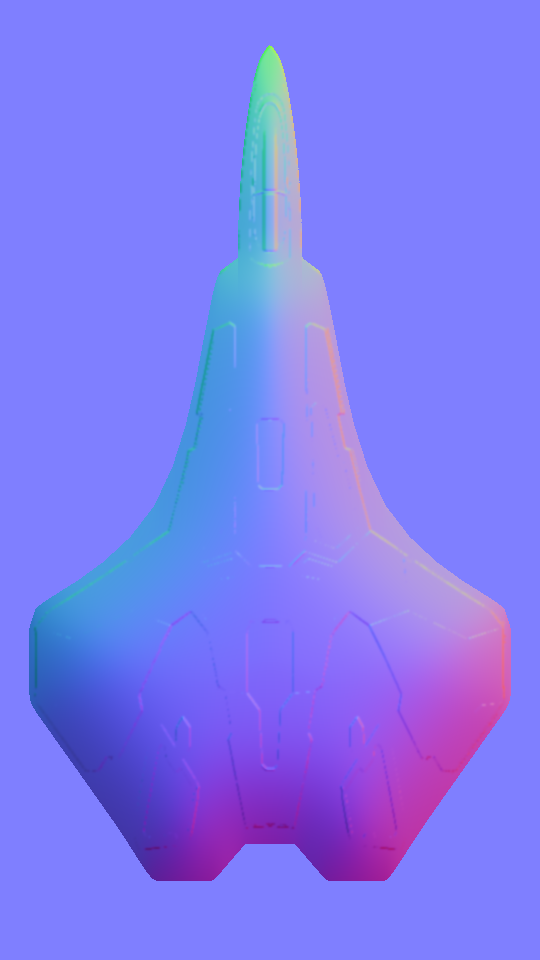

Archwyvern / ImageProcessor
=================================

Current tools:
- Normal map generation

TODO:
- Add X, Y flipping

Example with defaults:

    [imageprocessor[.exe]] normalmap generate \
        --bevel-ratio=100 \
        --bevel-height=25 \
        --bevel-smooth=50 \
        --emboss-height=1 \
        --emboss-smooth=1 \
        example/example.png

Input             |  Output
:-------------------------:|:-------------------------:
  |  

    $ ./imageprocessor normalmap generate --help
    NAME:
    imageprocessor normalmap generate - Create a normal map from a texture or every texture recursively

    USAGE:
    imageprocessor normalmap generate [command options] [directory or file]

    OPTIONS:
    --exclude value, -e value [ --exclude value, -e value ]  List of filename regular expressions for exclusion
    --suffix value, -s value                                 The normal map suffix (default: "_n")
    --bevel-ratio value                                      The percentage of depth to apply the bevel, this is roughly based on the number of opaque pixels (default: 100)
    --bevel-height value                                     The percentage of ratio to do weird stuff with how much of the image is faded. Less makes the normals appear more on the outside (default: 25)
    --bevel-smooth value                                     The percentage of depth to blur the bevel, e.g. 10% blur of 50% depth is 5% blur (default: 50)
    --emboss-height value                                    The height percentage of the emboss effect, higher percentage results in more vivid colors. (default: 1)
    --emboss-smooth value                                    The number of pixels to blur the source image before applying emboss. (default: 1)
    --help, -h                                               show help

Example Image: https://imgbin.com/png/9zPr0DJe/galaga-spaceship-s80-spaceship-free-spacecraft-png