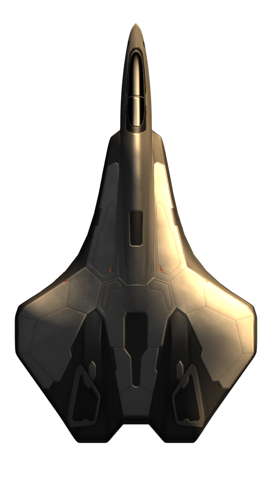
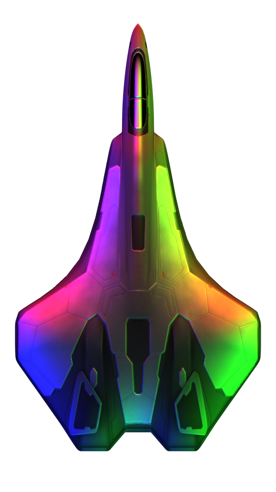

Archwyvern / ImageProcessor
=================================

The main goal of this project is to make the process of creating normal map textures for game assets a faster one.
If you have used tools that create normal maps for you then you will be familiar with what this program does. The main difference
is how they are processed.

Generally each image you want to create a normal map from requires three things, a bevel distance, bevel height, and an emboss height.
What this program aims to do is take ratios of these parameters and apply them to any image in a consistent manner. Usually when you
generate a normal map in an editor you set a bevel distance, height and smoothing based on the size of your textre. What this program does
instead is takes the ratios and applies them based on the density of the texture.

What this means is, you can run the tool with the same settings for any image regardless of size and the result will be almost identical.
Then you can run this program for an entire directory hierarchy and process all images in your project in a few seconds.

### Normal Map

Example (with defaults):

    [imageprocessor[.exe]] normalmap generate \
        --bevel-ratio=100 \
        --bevel-height=25 \
        --bevel-smooth=50 \
        --emboss-height=1 \
        --emboss-smooth=1 \
        example.png

Input             |  Output
:-------------------------:|:-------------------------:
  |  

    $ ./imageprocessor normalmap generate --help
    NAME:
    imageprocessor normalmap generate - Create a normal map from a texture or every texture recursively

    USAGE:
    imageprocessor normalmap generate [command options] [directory or file]

    OPTIONS:
    --exclude value, -e value [ --exclude value, -e value ]  List of filename regular expressions for exclusion
    --suffix value, -s value                                 The normal map suffix (default: "_n")
    --bevel-ratio value                                      The percentage of depth to apply the bevel, this is roughly based on the number of opaque pixels (default: 100)
    --bevel-height value                                     The percentage of ratio to do weird stuff with how much of the image is faded. Less makes the normals appear more on the outside (default: 25)
    --bevel-smooth value                                     The percentage of depth to blur the bevel, e.g. 10% blur of 50% depth is 5% blur (default: 50)
    --emboss-height value                                    The height percentage of the emboss effect, higher percentage results in more vivid colors. (default: 1)
    --emboss-smooth value                                    The number of pixels to blur the source image before applying emboss. (default: 1)
    --help, -h                                               show help

### Shining

Example shining with default:

    [imageprocessor[.exe]] normalmap shine \
        example.png

Example shining with rainbow:

    [imageprocessor[.exe]] normalmap shine \
        --color="FF0000" \
        --color="00FF00" \
        --color="0000FF" \
        --direction=0 \
        --direction=120 \
        --direction=-120 \
        --energy=1 \
        --energy=1 \
        --energy=1 \
        example.png

Default             |  Rainbow
:-------------------------:|:-------------------------:
 | 

Creating a shining requires that the normal map exists first, and you must specify the suffix if you haven't use the default.

    ./imageprocessor normalmap shine --help
    NAME:
    imageprocessor normalmap shine - Create an example texture with light applied. Requires a texture with a normal map.

    USAGE:
    imageprocessor normalmap shine [command options] [directory or file]

    OPTIONS:
    --exclude value, -e value [ --exclude value, -e value ]  List of filename regular expressions for exclusion
    --suffix value, -s value                                 The normal map suffix (default: "_n")
    --direction value [ --direction value ]                  The direction of the sun from north in degrees, clamped between -180 and 180 (default: 45)
    --energy value [ --energy value ]                        Sun's energy, essentially a color multiplier, baseline is 1, 0.5 is half, 2 is double (default: 1)
    --color value [ --color value ]                          Color of the light in 24bit hexadecimal (default: "ffca83")
    --shadow value                                           Percentage of base light level, for example 0.3 will darken the image to 30%% color is no light is present (default: 0.3)
    --reaction value                                         How reactive the texture is to the light, this is affected by shadow, a darker shadow requires a higher reaction (default: 10)
    --help, -h                                               show help

    PixelRGB = 
        (PixelRGB * Shadow) +
        (PixelRGB * Shadow * LightRGB * Energy * Normal.Dot(Direction) * Reaction)

Example Image: https://imgbin.com/png/9zPr0DJe/galaga-spaceship-s80-spaceship-free-spacecraft-png
